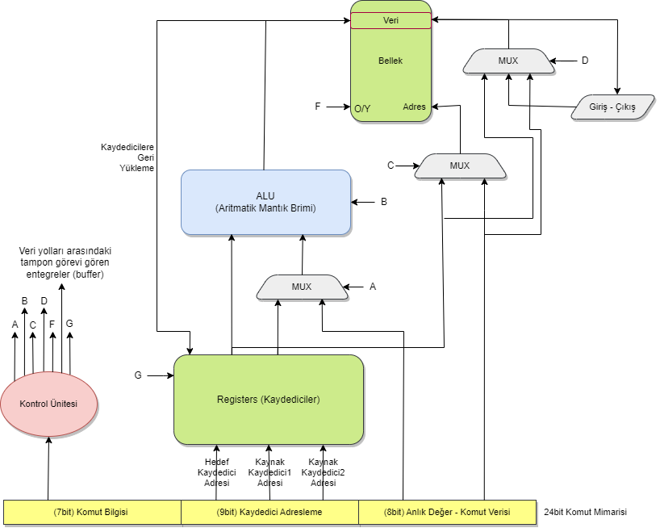
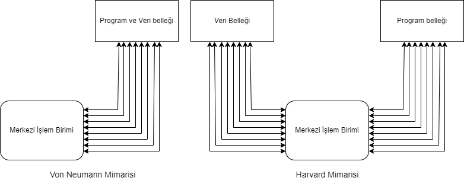
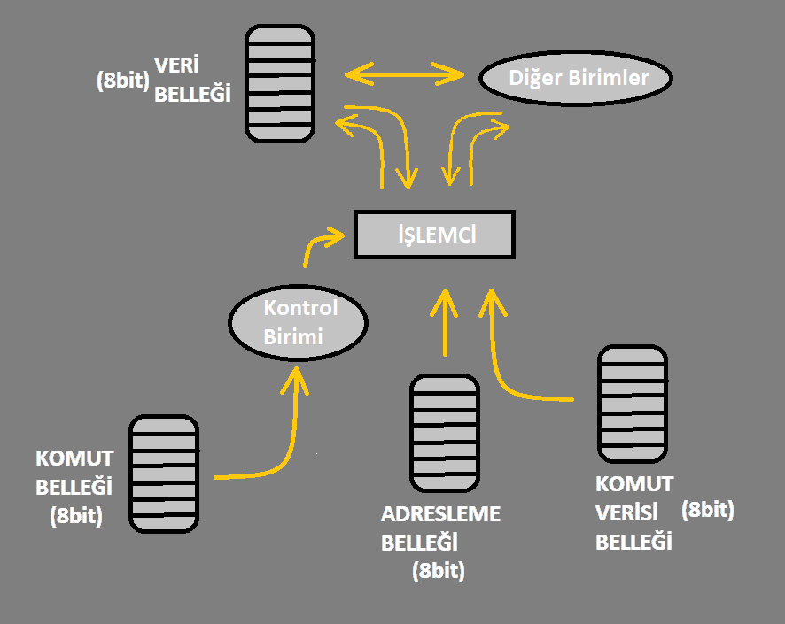
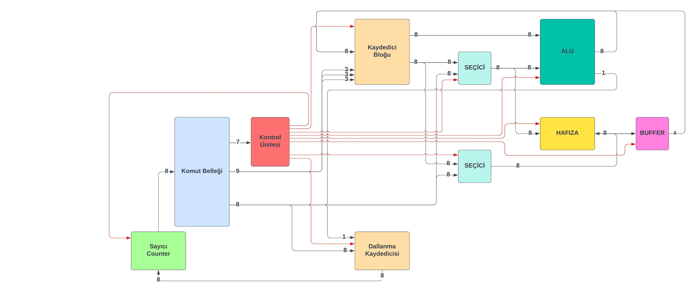
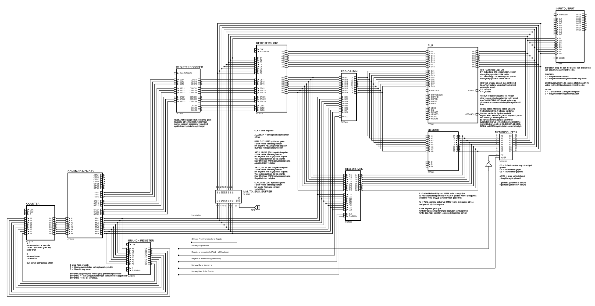
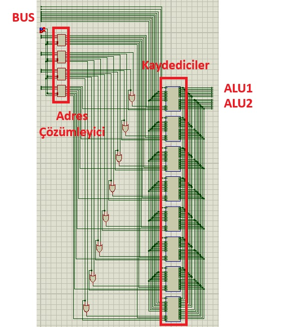

# An 8-Bit Processor Built From Discrete Logic

A complete 8-bit processor architecture — instruction set, datapath, ALU, register file, memory unit, program counter and hardwired control unit — designed from individual 74-series logic ICs and simulated in Proteus. No microcontroller, no FPGA, no HDL: every control line is a physical wire driven by AND/OR gates derived from Karnaugh maps.

This was a **TÜBİTAK 2209-A** undergraduate research project (April 2022 – September 2024).

| | |
|---|---|
| **Researcher** | Musa Akyüz |
| **Advisor** | Dr. Öğr. Üyesi Ümit Şentürk |
| **Program** | TÜBİTAK 2209-A University Students Research Projects Support Programme |
| **Duration** | 01.04.2022 – 20.09.2024 |
| **Status** | Complete in simulation; not fabricated |



---

## Table of contents

- [Motivation](#motivation)
- [Design overview](#design-overview)
- [Instruction format](#instruction-format)
- [Instruction set](#instruction-set)
- [Datapath modules](#datapath-modules)
  - [Register block](#register-block)
  - [Arithmetic Logic Unit](#arithmetic-logic-unit-alu)
  - [Memory unit](#memory-unit)
  - [Program counter and branch register](#program-counter-and-branch-register)
  - [Control unit](#control-unit)
- [Results and limitations](#results-and-limitations)
- [Repository layout](#repository-layout)
- [Opening the circuits](#opening-the-circuits)
- [References](#references)

---

## Motivation

Commercial processor design is a race to do more work in less silicon area, measured in nanometres. This project asks what that race looks like when you scale it *up* instead of down — when every gate, buffer and multiplexer is a discrete part you can point at, and every control decision has to be justified by hand.

The goal was not to build a competitive processor. It was to build one where **nothing is a black box**: to design the instruction set, derive the control logic from it, and be able to trace any bit from the instruction memory through to the output.

## Design overview

The processor follows a **Harvard architecture** — program memory and data memory are physically separate, each with its own bus. This removes the von Neumann bottleneck where instruction fetch and data access compete for one bus.



Key characteristics:

| Property | Value |
|---|---|
| Data width | 8-bit |
| Instruction width | 24-bit, fixed length |
| Architecture | Harvard (separate program / data memory) |
| Execution | Single-cycle — one instruction completes per clock |
| Registers | 8 general-purpose 8-bit registers |
| Data memory | 2 KB SRAM (6116), 11-bit addressing, on-die |
| Opcode space | 7 bits → 128 possible instructions |
| Instructions implemented | 26 |
| Control lines | 28, across 11 controllable circuits |
| Control logic | Hardwired, derived via Karnaugh maps (sum-of-products) |



Fixed-length instructions and single-cycle execution were deliberate: they make the program counter trivial (always +1, or +N on a taken branch) and remove any need for pipelining or instruction decoding state machines. The cost is paid entirely in the control unit's combinational complexity — see [Results](#results-and-limitations).

The data memory being placed *inside* the processor was also deliberate, aiming to avoid the access latency of going off-chip to RAM.

## Instruction format

Every instruction is exactly 24 bits, split into three fixed fields:

```
 ┌───────────────┬─────────────────────────────┬──────────────────┐
 │    7 bits     │           9 bits            │      8 bits      │
 │    opcode     │     register addressing     │  immediate value │
 ├───────────────┼───────┬─────────┬───────────┼──────────────────┤
 │  instruction  │  DST  │  SRC1   │   SRC2    │   8-bit data /   │
 │     type      │ 3 bit │  3 bit  │   3 bit   │  address / jump  │
 └───────────────┴───────┴─────────┴───────────┴──────────────────┘
```

- **Opcode (7 bits)** — selects the instruction. Feeds directly into the control unit, which derives all 28 control lines from it. 7 bits gives 128 possible instructions; 26 are used, leaving deliberate headroom for extension.
- **Register addressing (9 bits)** — three 3-bit fields addressing one of 8 registers each: `DST` (destination), `SRC1` and `SRC2` (sources). For `ADD`, this reads as *"add SRC1 and SRC2, write to DST"*.
- **Immediate (8 bits)** — multi-purpose. Depending on the instruction it carries a literal value, a memory address, or the number of instructions to skip on a taken branch.

Not every instruction uses every field; unused fields are ignored (marked `X` in the table below).



## Instruction set

Transcribed from [`docs/design/komutseti.ods`](docs/design/komutseti.ods). `DST` = destination register, `SRC1`/`SRC2` = source registers, `IMM` = 8-bit immediate. `✓` = field used, `X` = ignored.

### Arithmetic

| # | Mnemonic | Opcode | DST | SRC1 | SRC2 | IMM | Operation |
|---|---|---|---|---|---|---|---|
| 1 | `ADD` | `0000001` | ✓ | ✓ | ✓ | X | `DST = SRC1 + SRC2` |
| 2 | `ADDIMM` | `0000010` | ✓ | ✓ | X | ✓ | `DST = SRC1 + IMM` |
| 3 | `SUB` | `0000011` | ✓ | ✓ | ✓ | X | `DST = SRC1 - SRC2` |
| 4 | `SUBIMM` | `0000100` | ✓ | ✓ | X | ✓ | `DST = SRC1 - IMM` |

### Logic and shift

| # | Mnemonic | Opcode | DST | SRC1 | SRC2 | IMM | Operation |
|---|---|---|---|---|---|---|---|
| 5 | `AND` | `0000101` | ✓ | ✓ | ✓ | X | `DST = SRC1 & SRC2` |
| 6 | `ANDIMM` | `0000110` | ✓ | ✓ | X | ✓ | `DST = SRC1 & IMM` |
| 7 | `OR` | `0000111` | ✓ | ✓ | ✓ | X | `DST = SRC1 \| SRC2` |
| 8 | `ORIMM` | `0001000` | ✓ | ✓ | X | ✓ | `DST = SRC1 \| IMM` |
| 9 | `SHIFTLEFT` | `0001001` | ✓ | ✓ | X | X | `DST = SRC1 << 1` |
| 10 | `SHIFTRIGHT` | `0001010` | ✓ | ✓ | X | X | `DST = SRC1 >> 1` |

> The original proposal restricted shifts to register 3 only. The final design generalised this — with a redesigned register block and additional control lines, **any** register can be shifted.

### Load and store

| # | Mnemonic | Opcode | DST | SRC1 | SRC2 | IMM | Operation |
|---|---|---|---|---|---|---|---|
| 11 | `LBFROMIMM` | `0001011` | ✓ | X | X | ✓ | `DST = IMM` |
| 12 | `LBFROMMEM` | `0001100` | ✓ | X | X | ✓ | `DST = MEM[IMM]` |
| 13 | `REGTOREG` | `0001101` | ✓ | ✓ | X | X | `DST = SRC1` |
| 14 | `SBFROMIMM` | `0001110` | X | ✓ | X | ✓ | `MEM[SRC1] = IMM` |
| 15 | `SBFROMREG` | `0001111` | X | ✓ | X | ✓ | `MEM[IMM] = SRC1` |

### Branches

All branches compare two registers and, if the condition holds, skip forward by `IMM` instructions. Together these enable `if`/`else` and `for`/`while` control flow.

| # | Mnemonic | Opcode | DST | SRC1 | SRC2 | IMM | Operation |
|---|---|---|---|---|---|---|---|
| 16 | `BEQ` | `0010000` | X | ✓ | ✓ | ✓ | `if SRC1 == SRC2: PC += IMM` |
| 17 | `BNE` | `0010001` | X | ✓ | ✓ | ✓ | `if SRC1 != SRC2: PC += IMM` |
| 18 | `BLT` | `0010010` | X | ✓ | ✓ | ✓ | `if SRC1 < SRC2: PC += IMM` |
| 19 | `BGT` | `0010011` | X | ✓ | ✓ | ✓ | `if SRC1 > SRC2: PC += IMM` |
| 20 | `BGE` | `0010100` | X | ✓ | ✓ | ✓ | `if SRC1 >= SRC2: PC += IMM` |
| 21 | `BLE` | `0010101` | X | ✓ | ✓ | ✓ | `if SRC1 <= SRC2: PC += IMM` |

### Input / output

| # | Mnemonic | Opcode | DST | SRC1 | SRC2 | IMM | Operation |
|---|---|---|---|---|---|---|---|
| 22 | `PRINTREG` | `0010110` | X | ✓ | X | X | `OUT = SRC1` |
| 23 | `PRINTREGANDLOAD` | `0010111` | ✓ | ✓ | X | X | `DST = OUT = SRC1` |
| 24 | `PRINTMEMFROMREG` | `0011000` | X | ✓ | X | X | `OUT = MEM[SRC1]` |
| 25 | `PRINTMEMFROMIMM` | `0011001` | X | X | X | ✓ | `OUT = MEM[IMM]` |
| 26 | `WRITETOREG` | `0011010` | ✓ | X | X | X | `DST = IN` |
| 27 | `WRITETOMEMFROMREG` | `0011011` | X | ✓ | X | X | `MEM[SRC1] = IN` |
| 28 | `WRITETOMEMFROMIMM` | `0011100` | X | X | X | ✓ | `MEM[IMM] = IN` |

> **A note on instruction count.** The worksheet above lists 28 entries with contiguous opcodes. The final report describes the set as *reduced to 26* — four instructions from the original 28-instruction proposal were removed and two new ones added — and elsewhere states 24. These counts are inconsistent in the source report; the table here reproduces the worksheet verbatim rather than guessing which entries were dropped.

## Datapath modules

The full schematic, with all modules wired together:



### Register block

Eight 8-bit general-purpose registers. Each register is built from **two 74LS173** 4-bit D-type registers (4 + 4 = 8 bits), with **two 74LS245** octal buffers selecting which output bus the value drives — either the ALU's first operand port or its second.



The block contains its own address decoders. Four decoders sit below the register array, handling in order:

1. destination register (write-back),
2. source register 1,
3. source register 2,
4. register to be cleared.

An upstream selector routes the 9 addressing bits either to the normal addressing pins or to the clear pins, depending on whether the current instruction is a clear or a write.

Vector schematics: [`register-block-internals.svg`](docs/images/register-block-internals.svg), [`single-register.svg`](docs/images/single-register.svg).

### Arithmetic Logic Unit (ALU)


The ALU is composed of six independent sub-circuits, each enabled by its own control line, all feeding a shared output bus through buffers:

| Sub-circuit | Function | Control lines |
|---|---|---|
| Adder / subtractor | `+`, `-` | `ADD/SUBB` (operation select), `BUFFADD/SUB` (output enable) |
| AND array | bitwise `&` | `BUFAND` |
| OR array | bitwise `\|` | `BUFOR` |
| Left shifter | `<< 1` | `BUFSL` |
| Right shifter | `>> 1` | `BUFSR` |
| Comparator | 6 comparison modes | `LESS`, `EQ`, `BIGGER`, `LESSEQ`, `BIGEQ`, `NOTEQ` |

The comparator (74LS85-based) drives a single `OBRANCH` output which feeds directly into the branch register and program counter — this is what makes conditional branching work in a single cycle.

Addition/subtraction uses 74LS283 full adders; the shift circuits are pure rewiring plus buffers.

### Memory unit

A **6116 static RAM**: 11-bit address space × 8-bit words (2 KB). Because the 6116 shares the same pins for reads and writes, buffers and selectors were added to arbitrate direction and prevent the memory from fighting the main bus for control.

Control lines: `E` (enable), `R` (read), `W` (write), plus `MIN/MOUT` and an enable on the bus buffer to set data direction.

Both the address and the data can come from either a register or the immediate field, chosen by two multiplexers (`REGTOIMM1`, `REGTOIMM2`, `E-MEM-D`). This is what allows a future assembler to freely mix `MEM[reg]` and `MEM[imm]` addressing forms. The datapath also already supports writing input-unit data straight into memory, even though no instruction currently exercises that path.

### Program counter and branch register

Because instructions are fixed-length and single-cycle, the counter is simple: increment by 1 each cycle. The branch register sits alongside it, loaded with the instruction's immediate field.

The comparator's `OBRANCH` output is wired to both the branch register and the counter. On a taken branch the counter jumps forward by the value in the branch register; otherwise it keeps incrementing by one. Control lines: `SLC` (select load vs. count), `E` (count enable), `BUFFBRNC` (branch register output enable).

### Control unit

This is by far the most complex circuit in the design. Every module on the datapath has at least one control input — buffers and selectors decide which path data takes, and a single bit flipped there changes the entire result of an instruction. In total there are **28 control lines across 11 circuits**, most of them enable signals.

The unit is purely combinational: 7 opcode bits in, 28 control bits out. It was derived by building a truth table of *every instruction × every control line*, then minimising each column with a **Karnaugh map**.


The complete truth table lives in [`docs/design/Karnough.xlsx`](docs/design/Karnough.xlsx), grouped by target circuit:

| Circuit | Control lines |
|---|---|
| Program counter | `SLC`, `E` |
| Branch register | `BUFFBRNC` |
| Immediate→register path | `ITR` |
| Operand multiplexers | `REGTOIMM1`, `REGTOIMM2`, `E-MEM-D` |
| ALU | `ADD/SUBB`, `BUFFADD/SUB`, `BUFAND`, `BUFOR`, `BUFSR`, `BUFSL`, `LESS`, `EQ`, `BIGGER`, `LESSEQ`, `BIGEQ`, `NOTEQ` |
| Memory | `E`, `R`, `W` |
| Memory bus buffer | `MIN/MOUT`, `Enable Buf.` |
| Input / output | `EnableIn`, `LCD/D` |

Minimisation was done with **Karnaugh Studio**, which outputs each control line as a sum-of-products (DNF) expression. For example, the counter's `SLC` line reduces to:

```
SLC = (x1 · x̄2 · x̄3) + (x2 · x3 · x4)
```

which is then built directly as two AND gates feeding one OR gate. All 28 lines were implemented this way, in discrete AND/OR/NOT gates.

## Results and limitations

### What worked

- A functioning single-cycle 8-bit processor in simulation, with a coherent instruction set covering arithmetic, logic, shifts, memory access, six branch conditions, and I/O.
- **Room to grow by design.** The 7-bit opcode addresses 128 instructions and only 26 are used. As long as the existing instructions and datapath are left intact, new circuits and opcodes can be added without redesigning the control unit.
- **Width is not baked into the control logic.** Because the control unit only decodes opcodes, the same control unit and instruction set could drive a 16-, 32- or 64-bit version — only the datapath circuits would need widening.

### What the Harvard choice actually cost

Separating program and data memory did simplify data access, but it pushed complexity into the control unit and increased the physical footprint. The single-cycle, one-instruction-per-clock decision compounded this — with no multi-cycle state machine to spread work across, *every* control line has to be correct combinationally for *every* instruction.

The honest conclusion from the report: the advantage gained at the datapath appears to be largely given back in control unit complexity. Whether that trade is worth it depends entirely on the intended workload — and with 8-bit words and 2 KB of memory, this processor has no practical workload today. Its value is as a design study, not a product.

### The missing assembler

An assembler/compiler was planned in the original proposal but was not completed. Without it, programs must be written into the instruction memory **by hand, in binary**, and verification means stepping the simulation and inspecting signals manually. This is the single biggest obstacle to testing the processor at any scale, and the most valuable thing anyone extending this project could build first.

### Not fabricated

The project exists entirely in simulation. There were no material costs. Turning the design into a PCB remains an open next step — a preliminary bill of materials is in [`docs/design/Malzeme Listesi Tahmini.txt`](docs/design/Malzeme%20Listesi%20Tahmini.txt) and [`hardware/02-prototype-2022/`](hardware/02-prototype-2022/).

### Publications

None. A conference paper was drafted but never submitted; the drafts are in [`docs/paper/`](docs/paper/).

## Repository layout

```
├── docs/
│   ├── images/          Figures and schematic exports (PNG / SVG)
│   ├── report/          TÜBİTAK 2209-A proposal and final report
│   ├── paper/           Unpublished conference paper drafts
│   └── design/          Instruction set worksheet, Karnaugh truth table,
│                        BOM estimate, method notes, draw.io sources
├── hardware/
│   ├── 01-building-blocks/   Individual component circuits tested in isolation
│   │                         (decoder, mux, comparator, register, buffer,
│   │                          adder/subtractor, shifters, counter, clock, RAM)
│   ├── 02-prototype-2022/    First full integration + bill of materials
│   ├── 03-revision-2023/     Revised processor with the control block added
│   └── 04-final-2024/        Final design + per-module test benches
├── datasheets/          Datasheets for every IC used
└── references/          Cited papers and specifications
```

The `hardware/` folders are ordered to follow the design's actual history: components were built and verified individually first, integrated into a working datapath in 2022, given a proper hardwired control unit in 2023, and finalised with module-level test benches in 2024.

## Opening the circuits

The circuits are **Proteus Design Suite** projects (`.pdsprj`) and require Proteus (version 8 or later) to open and simulate. There is no build step.

Start with [`hardware/04-final-2024/8BitProcessor.pdsprj`](hardware/04-final-2024/) — this is the complete, final processor. The `*Test.pdsprj` files alongside it are isolated test benches for individual modules (adder/subtractor, comparator, counter, memory, register), useful for understanding one block at a time.

To run a program you currently have to enter the 24-bit instruction words into the instruction memory manually, then step the clock and observe the buses — see [the missing assembler](#the-missing-assembler).

If you don't have Proteus, [`docs/images/full-schematic.svg`](docs/images/full-schematic.svg) is a full vector export of the final schematic that opens in any browser.

## References

Key works consulted during the design. PDFs of the openly-available papers and specifications are in [`references/`](references/); the textbooks below are cited but not redistributed here.

**Books**

- Hennessy, J. L., & Patterson, D. A. *Computer Architecture: A Quantitative Approach* (5th ed.). Morgan Kaufmann.
- Tanenbaum, A. S., & Austin, T. *Structured Computer Organization*. Pearson.

**Papers and specifications**

- von Neumann, J. *First Draft of a Report on the EDVAC* (1945).
- Moore, G. E. *Cramming More Components onto Integrated Circuits* (1965).
- *The RISC-V Instruction Set Manual*, Volume I: User-Level ISA, v2.2 — the primary influence on the instruction format, though this design uses fixed-length instructions throughout where RISC-V does not.
- *Design of a 16-Bit Harvard Structure RISC Processor in Cadence 45nm Technology*.
- Intel 4004 datasheet and Intel 1976 annual report — historical reference for early single-chip processor design.

---

## License

No license file is included; all rights reserved by default. This is an academic research project — please contact the author before reusing the design, figures, or report material.

Datasheets in `datasheets/` and papers in `references/` remain the property of their respective publishers and are included for reference only.
